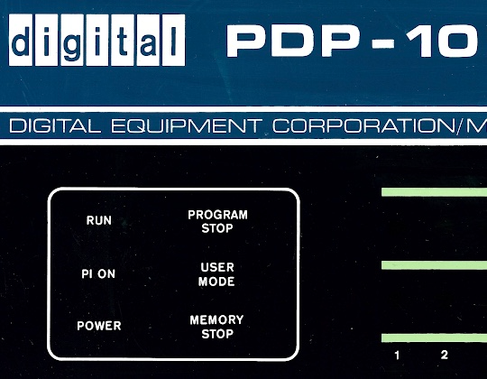

# decwar history

collaboration around preserving decwar history

- 1971, [original single player star trek](https://en.wikipedia.org/wiki/Star_Trek_(1971_video_game)), written in basic for ucal irvine sds sigma 7, mike mayfield. in 1971, mike mayfield, then in his final year of high school, frequented a computer lab at the university of california, irvine, while teaching himself how to program. the lab operated both a sds sigma 7 and a dec pdp10. the pdp10 hosted a version of the 1962 pdp1 spacewar. mayfield had gained illicit access to the sigma 7 at the lab and wanted to create his own version of the game for the system. spacewar required a vector graphics display, however, and the sigma 7 only had access to a non-graphical teletype model 33.
- 1972, rewrite of original, basic for hp 2000c at hp office near ucal irvine, mike mayfield
- 1973, ut trek, written in basic, grady hicks and jim korp on utexas cdc6600
- 1974, ut fortran, aka [super star trek](https://gitlab.com/esr/super-star-trek), single player fortran on utexas cdc6600, dave matuszek and paul reynolds
- mid 70s, war, fortran two player version written for utexas cdc6600, author unknown, rewritten by robert schneider
- 1978, [decwar](https://en.wikipedia.org/wiki/Decwar#Original_versions), assembly and fortran, eighteen player version written for utexas pdp10, bob hysick and jeff potter. version 1.0 of decwar was released in august 1978. the university would make copies available on tape for the nominal fee of $50, and it soon appeared on pdp10s around the world. the greatly updated 2.0 was released in july 1979, and another major version, 2.3, on 20 november 1981.

[utexas center for american history](https://briscoecenter.org/) catalog item [v2.2](https://repositories.lib.utexas.edu/items/1aa48343-09ab-4b3b-a9f2-e2e525074a4d) has files migrated from a decus magnetic tape, including a somewhat doubtful patched executable, but no source code. here's the instructions a utexas player saw [june 3, 1980 v2.2 utexas](docs/DECWAR22.HLP). utexas decwar had eighteen playable ships. this is also definitely what players at the southwest texas state university computation center, san marcos texas, saw circa 1983 and 1984.

[utexas center for american history](https://briscoecenter.org/) catalog item [v2.3](https://repositories.lib.utexas.edu/items/7e2ccf50-e814-4bce-91d2-a7f6440eabe4) is source code ported circa 2011 by merlyn cousins from the compuserve decwar 2.3 source code to simh pdp10. harris newman received this code around 1995, as discussed elsewhere in this repo. it started as an original utexas 2.3 tape and had been modified by compuserve circa 1981 for commercial purposes. here's the instructions a compuserve player saw [november 20, 1981 v2.3 compuserve](docs/DECWAR23CIS.HLP). compuserve decwar had ten playable ships.

other links

- https://github.com/drforbin/decwar/discussions - decwar central
- https://en.wikipedia.org/wiki/Decwar - wikipedia page
- http://hsnewman.freeshell.org/decwar.htm - harris newman's decwar page
- https://www.youtube.com/@statespacedev - 'bad vids'
- https://gitlab.com/decwar/utexas - pure stone age 'going backwards' reconstruction of utexas 2.3
- https://gitlab.com/decwar/merely-players - pure python robots
- https://gitlab.com/decwar/galaxy - pure p5js galaxy display
- https://gitlab.com/decwar/history - pure 'junkpile':)

